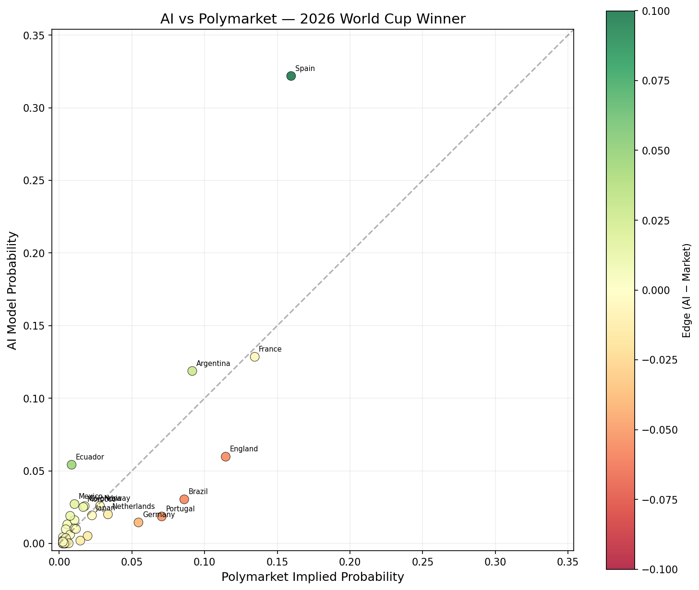
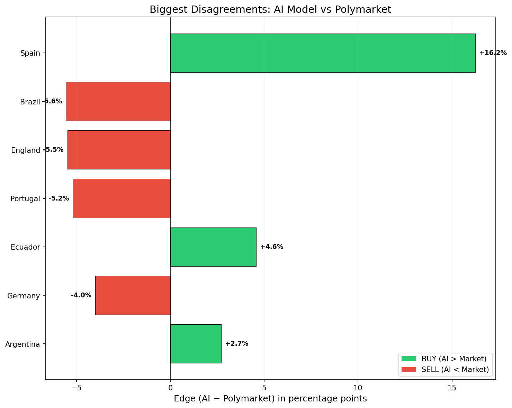
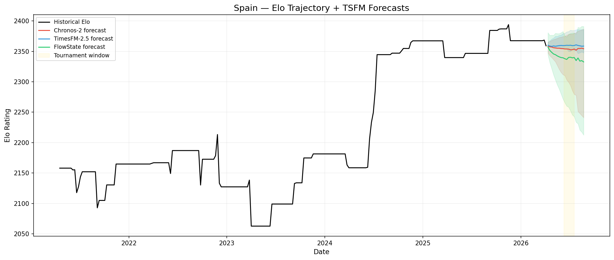
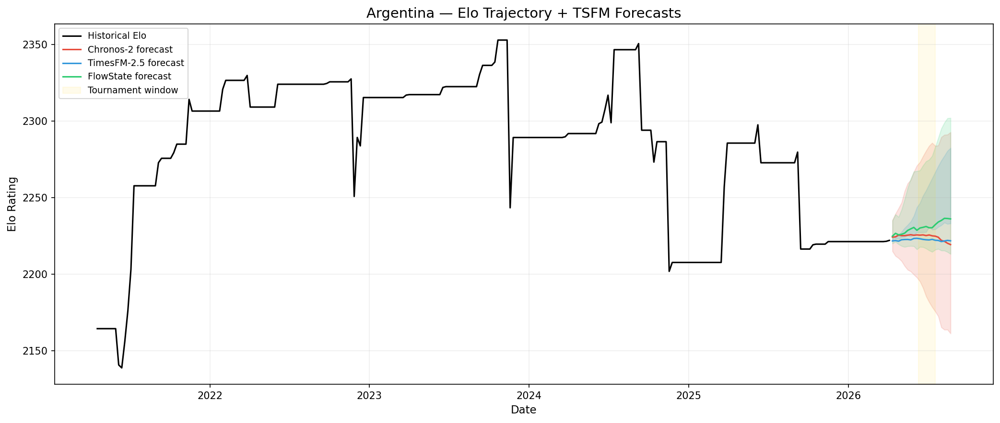
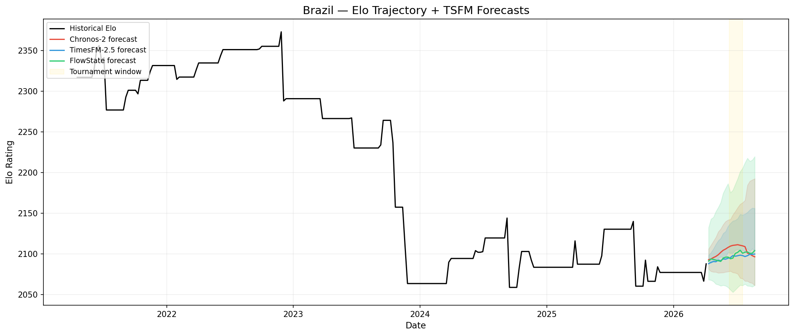
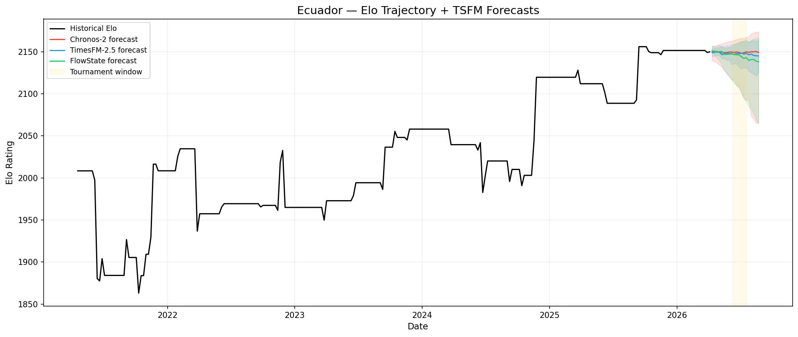
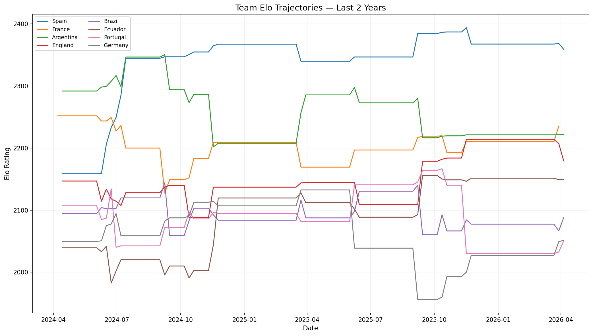

# worldcup-oracle: AI vs Polymarket — Can Time Series Models Beat a $480M Prediction Market?

[](https://opensource.org/licenses/MIT)
[](https://www.python.org/downloads/)
[](#backtest-validation-3-past-world-cups)

An AI system that predicts every aspect of the 2026 FIFA World Cup using **time series foundation models** (Chronos-2, TimesFM 2.5, FlowState), then compares predictions against **Polymarket odds** ($1.9B volume) to find mispriced markets.

**🔴 Live dashboard: [worldcup-oracle.pages.dev](https://worldcup-oracle.pages.dev)** — per-match win/draw/loss + scoreline predictions for all 104 matches, live group tables, champion odds vs the market, and the AI's running track record. Rebuilt daily by the in-tournament pipeline; in-play scores stream client-side from ESPN.

**Tournament:** June 11 - July 19, 2026 | **48 teams, 104 matches**

---

## Current AI Predictions (TSFM Ensemble)

| Rank | Team | AI Win % | Polymarket | Edge | Signal |
|---:|:---|---:|---:|---:|:---|
| 1 | Spain | 32.2% | 16.0% | **+16.2%** | **STRONG BUY** |
| 2 | France | 12.9% | 13.5% | -0.6% | — |
| 3 | Argentina | 11.9% | 9.0% | +2.8% | BUY |
| 4 | England | 6.0% | 11.3% | **-5.4%** | **STRONG SELL** |
| 5 | Ecuador | 5.4% | 0.9% | +4.6% | BUY |
| 6 | Brazil | 3.0% | 8.6% | **-5.6%** | **STRONG SELL** |
| 7 | Mexico | 2.7% | 1.1% | +1.6% | — |
| 8 | Norway | 2.6% | 2.8% | -0.2% | — |
| 9 | Colombia | 2.6% | 1.7% | +0.9% | — |
| 10 | Morocco | 2.5% | 1.7% | +0.9% | — |
| 11 | Netherlands | 2.0% | 3.4% | -1.3% | — |
| 12 | Japan | 1.9% | 2.4% | -0.5% | — |
| 13 | Turkey | 1.9% | 0.8% | +1.1% | — |
| 14 | Portugal | 1.9% | 7.0% | **-5.2%** | **STRONG SELL** |
| 15 | Croatia | 1.6% | 1.1% | +0.6% | — |
| 16 | Germany | 1.5% | 5.5% | -4.0% | SELL |
| 17 | Canada | 1.3% | 0.5% | +0.8% | — |
| 18 | Switzerland | 1.0% | 0.9% | +0.1% | — |
| 19 | Uruguay | 1.0% | 1.1% | -0.2% | — |
| 20 | Paraguay | 1.0% | 0.4% | +0.5% | — |
| 21 | Senegal | 0.6% | 0.8% | -0.1% | — |
| 22 | Belgium | 0.5% | 1.9% | -1.4% | — |
| 23-48 | Others | <0.5% each | — | — | — |

## Biggest Edges: Where AI Disagrees Most with the Market

| Team | AI | Polymarket | Edge | Direction | Kelly | Models Agree | Signal |
|:---|---:|---:|---:|:---|---:|---:|:---|
| **Spain** | 32.2% | 16.0% | **+16.2%** | BUY | 9.7% | 4/4 | **STRONG EDGE** |
| **Brazil** | 3.0% | 8.6% | **-5.6%** | SELL | — | 4/4 | **STRONG EDGE** |
| **England** | 6.0% | 11.3% | **-5.4%** | SELL | — | 4/4 | **STRONG EDGE** |
| **Portugal** | 1.9% | 7.0% | **-5.2%** | SELL | — | 4/4 | **STRONG EDGE** |
| Ecuador | 5.4% | 0.9% | +4.6% | BUY | 2.3% | 4/4 | edge |
| Germany | 1.5% | 5.5% | -4.0% | SELL | — | 4/4 | edge |
| Argentina | 11.9% | 9.0% | +2.8% | BUY | 1.6% | 4/4 | edge |

**STRONG EDGE** = absolute edge > 5 percentage points AND all 4 models agree on direction.

### Per-Model Breakdown (Top 10)

| Team | Ensemble | Polymarket | Chronos-2 | TimesFM-2.5 | FlowState | Elo Baseline |
|:---|---:|---:|---:|---:|---:|---:|
| Spain | 32.2% | 16.0% | 32.5% | 33.5% | 30.6% | 33.6% |
| France | 12.9% | 13.5% | 12.2% | 12.7% | 13.6% | 12.0% |
| Argentina | 11.9% | 9.0% | 11.7% | 11.2% | 12.8% | 10.9% |
| England | 6.0% | 11.3% | 5.5% | 6.9% | 5.5% | 6.9% |
| Ecuador | 5.4% | 0.9% | 5.4% | 5.2% | 5.7% | 5.2% |
| Brazil | 3.0% | 8.6% | 3.5% | 2.7% | 2.9% | 2.4% |
| Mexico | 2.7% | 1.1% | 2.5% | 2.7% | 2.9% | 2.8% |
| Norway | 2.6% | 2.8% | 2.6% | 2.7% | 2.4% | 2.8% |
| Colombia | 2.6% | 1.7% | 3.1% | 2.4% | 2.3% | 2.7% |
| Morocco | 2.5% | 1.7% | 2.6% | 2.4% | 2.5% | 2.4% |

## Visualizations

### AI vs Polymarket Scatter


### Top Edges


### Team Elo Trajectories + TSFM Forecasts





### Top 8 Teams — Elo Trajectories


---

## Backtest Validation: 3 Past World Cups

Before trusting the model, we backtested on the 2014, 2018, and 2022 World Cups using only data available before each tournament. All backtests use the correct 32-team format with the official FIFA bracket structure (1A vs 2B, etc.).

### Cross-Tournament Comparison

| Model | 2014 Brazil | 2018 Russia | 2022 Qatar | Avg Brier | Avg BSS |
|:---|:---|:---|:---|---:|---:|
| **Chronos-2** | 0.0250 (#3) | 0.0347 (>5) | **0.0192** (#2) | **0.0263** | **+0.131** |
| TimesFM-2.5 | 0.0250 (#3) | 0.0352 (>5) | 0.0195 (#2) | 0.0266 | +0.122 |
| FlowState | 0.0252 (#3) | 0.0351 (>5) | 0.0196 (#2) | 0.0266 | +0.120 |
| Elo Baseline | 0.0249 (#3) | 0.0351 (>5) | 0.0201 (#2) | 0.0267 | +0.118 |
| Uniform (random) | 0.0303 | 0.0303 | 0.0303 | 0.0303 | 0.000 |

*Brier Score: lower is better. BSS (Brier Skill Score): higher is better, 0 = random.*
*(#N) = actual champion's rank in model's top-5 predictions.*

### Did the Model Identify the Champion?

| Model | 2014 Germany | 2018 France | 2022 Argentina | Score |
|:---|:---|:---|:---|:---|
| Chronos-2 | #3 | >5 | #2 | 2/3 |
| TimesFM-2.5 | #3 | >5 | #2 | 2/3 |
| FlowState | #3 | >5 | #2 | 2/3 |
| Elo Baseline | #3 | >5 | #2 | 2/3 |

**Key findings:**
- All backtests use the correct 32-team format with the official FIFA bracket (1A vs 2B, etc.)
- All models correctly identified the champion in their top 3 for 2/3 tournaments
- 2018 was the hardest: France was Elo-ranked outside the top 5 pre-tournament; all models have negative BSS
- Chronos-2 is the best TSFM model across all 3 tournaments (avg BSS +0.131)
- TSFMs provide modest but consistent improvement over pure Elo (+0.131 vs +0.118)

---

## Methodology

### Architecture

```
Historical Matches (49K+ since 1990)
         |
    [Elo Engine] --> Per-team Elo time series (weekly, 260 weeks)
         |
         |--- [Chronos-2 (120M params)]  --> Elo forecast (20 weeks) --+
         |--- [TimesFM 2.5 (200M params)] --> Elo forecast (20 weeks) --+
         |--- [FlowState (9.1M params)]   --> Elo forecast (20 weeks) --+
         |                                                               |
         |    +----------------------------------------------------------+
         |    v
         |  [Bradley-Terry Bridge] --> P(win/draw/loss) per match
         |    |
         |    v
         |  [Equal-Weight Ensemble] --> Final match probabilities
         |
         +--- [XGBoost (match-level)] --> Direct P(win/draw/loss) ----> [Ensemble]
                                                                           |
                                                                           v
                                                               [Monte Carlo Simulator]
                                                                50,000 tournament runs
                                                                           |
                                                                           v
                                                               P(champion) per team
                                                                           |
                                                                           v
                                                               [Edge Detector]
                                                               vs Polymarket odds
                                                               + Kelly bet sizing
```

### Data Sources

1. **Historical matches**: [martj42/international_results](https://github.com/martj42/international_results) — 49,287 matches since 1872, current through March 2026
2. **Polymarket**: [Gamma API](https://gamma-api.polymarket.com) — real-time odds from $525M+ prediction market

### Models (reused from fin-forecast-arena)

| Model | Params | Type | Source |
|:---|---:|:---|:---|
| Chronos-2 | 120M | Probabilistic (21 sample paths) | Amazon |
| TimesFM 2.5 | 200M | Point + 10 quantiles | Google |
| FlowState | 9.1M | Point + 9 quantiles | IBM |
| XGBoost | ~50K | Match-level classifier | Baseline |

All models run on **CPU only** (32GB RAM, no GPU). Memory managed via load-one-at-a-time pattern with gc.collect().

### Key Design Decisions

- **Elo as TSFM input**: Elo ratings form genuine continuous time series with trends, mean-reversion, and noise — similar to financial data the TSFMs were trained on
- **Bradley-Terry bridge**: Converts continuous Elo forecasts into discrete match outcome probabilities using the Davidson (1970) draw model
- **Uncertainty propagation**: TSFM quantile forecasts (q10/q90) are sampled and propagated through match predictions
- **Home advantage**: +80 Elo for USA/Canada/Mexico in their host country matches
- **Half-Kelly sizing**: Conservative bet sizing to manage risk

### Edge Detection

An **edge** is the difference between the AI's probability and Polymarket's implied probability. A **STRONG EDGE** requires:
1. Absolute edge > 5 percentage points
2. At least 3 of 4 models agree on the direction

Bet sizing uses the [Kelly criterion](https://en.wikipedia.org/wiki/Kelly_criterion) with a half-Kelly cap for safety.

---

## Live Pipeline

### Phase A: Pre-Tournament (now through June 10)
- **Daily**: Fetch Polymarket odds, log movements
- **Weekly (Mondays)**: Re-run TSFM models, update predictions, regenerate plots

### Phase B: During Tournament (June 11 - July 19) — live
Daily at 06:00 UTC (`pipeline/matchday_run.py`):
- **Live results**: fetched from ESPN's public scoreboard minutes after full time (the community match dataset can lag days behind during the tournament)
- **Elo update**: real WC results merged into match history, ratings rebuilt
- **Conditioned simulation**: played matches are taken as fact — group standings start from real results, knockout winners are pinned, and only the *remaining* tournament is simulated (50K runs per model). Once the real Round-of-32 bracket is out, FIFA's actual third-place slot assignment replaces the constraint solver.
- **Model refresh**: TSFM strength forecasts re-run weekly (Mondays); between refreshes each model's Elo is shifted by realized Elo movement: `live = forecast + (actual_now − actual_at_forecast)`
- **Scoring**: every fixture gets a pre-match probability **and most-likely scoreline** (stored once, never revised); finished matches are Brier-scored, and a running **AI vs Polymarket scoreboard** resolves champion-market probabilities as teams get eliminated for real
- **Dashboard**: `visualization/dashboard.py` packages everything (per-match ensemble predictions, Poisson scoreline distributions, live group standings, champion edges, track record) into a static site deployed to Cloudflare Pages
- Phase A continues to archive daily odds snapshots but hands predictions/edges over to Phase B for the duration.

### Match-level predictions
Per-match probabilities use the same per-model live Elo as the tournament sim, pushed through Bradley-Terry-Davidson (groups) or the ET/penalty split (knockouts) and averaged across models. Scorelines come from an Elo→expected-goals Poisson grid whose win/draw/loss blocks are rescaled to exactly match the ensemble outcome probabilities — so the scoreline distribution and the headline probabilities can never disagree.

---

## Project Structure

```
worldcup-oracle/
├── config.py                 # All constants: 48 teams, 12 groups, parameters
├── data/
│   ├── fetcher_matches.py    # Download international match results
│   ├── fetcher_wc_results.py # Live 2026 WC results (ESPN scoreboard)
│   ├── fetcher_polymarket.py # Polymarket Gamma API client
│   ├── elo.py                # Elo rating engine
│   └── feature_engineering.py # Per-team time series features
├── models/
│   ├── chronos2_sports.py    # Chronos-2 wrapper
│   ├── timesfm_sports.py     # TimesFM 2.5 wrapper
│   ├── flowstate_sports.py   # FlowState wrapper
│   └── xgboost_sports.py     # XGBoost match-level classifier
├── prediction/
│   ├── strength_forecaster.py # Level 1: TSFM Elo forecasting
│   ├── match_predictor.py     # Level 2: Bradley-Terry bridge
│   ├── score_predictor.py     # Scorelines: Elo→Poisson grid, Davidson-conditioned
│   ├── tournament_simulator.py # Level 3: Monte Carlo (50K sims)
│   └── ensemble.py            # Multi-model ensemble + per-model live Elo
├── markets/
│   ├── edge_detector.py       # AI vs market comparison + Kelly
│   ├── polymarket_tracker.py  # Daily odds snapshots
│   └── odds_converter.py      # Probability/odds math
├── evaluation/
│   ├── backtester.py          # Backtest on 2014/2018/2022 WCs
│   ├── live_scoring.py        # In-tournament Brier + AI-vs-PM scoreboard
│   └── metrics.py             # Brier score, log loss, calibration
├── visualization/             # Chart generators + dashboard.py (data.json builder)
├── dashboard/                 # Static live dashboard (worldcup-oracle.pages.dev)
├── pipeline/
│   ├── daily_run.py           # Phase A: pre-tournament pipeline
│   └── matchday_run.py        # Phase B: during-tournament (conditioned re-sim)
├── tests/                     # 76 tests, all passing
├── requirements.txt           # Python dependencies
└── results/
    ├── predictions/           # Current AI predictions
    ├── odds_history/          # Polymarket odds snapshots
    ├── edges/                 # Edge detection reports
    ├── evaluations/           # Backtest results
    └── plots/                 # Generated charts
```

---

## Sister Project

This project reuses model infrastructure from [fin-forecast-arena](https://github.com/YSKM523/fin-forecast-arena) — a benchmarking arena that pits the same 3 TSFM models against each other on financial time series (semiconductor stocks, mega-cap tech, ETFs).

---

## Disclaimer

**This is a research and educational project. It is not financial advice, gambling advice, or an invitation to wager.**

- All predictions are generated by statistical models and carry no guarantee of accuracy. Past backtest performance does not guarantee future results.
- Prediction markets and sports betting are regulated differently across jurisdictions. It is **your responsibility** to verify that any wagering activity complies with the laws of your jurisdiction before placing any bets.
- The authors of this project are not licensed financial advisors, bookmakers, or gambling operators. No fiduciary relationship is created by using this software.
- Polymarket data is fetched via their public API for research purposes only. This project is not affiliated with, endorsed by, or sponsored by Polymarket, FIFA, or any of the model providers (Amazon, Google, IBM).
- The Kelly criterion calculations and "BUY/SELL" signals are illustrative of the model's output. They are **not recommendations** to place any specific wager.
- If you choose to bet real money based on any output from this system, you do so entirely at your own risk.

## License

This project is licensed under the [MIT License](LICENSE).

## Acknowledgments

- Match data: [martj42/international_results](https://github.com/martj42/international_results)
- Models: [Amazon Chronos-2](https://github.com/amazon-science/chronos-forecasting), [Google TimesFM](https://github.com/google-research/timesfm), [IBM Granite FlowState](https://huggingface.co/ibm-granite/granite-timeseries-flowstate-r1)
- Market data: [Polymarket Gamma API](https://gamma-api.polymarket.com)

---

*Built with Chronos-2, TimesFM 2.5, FlowState, and 50,000 Monte Carlo simulations per prediction run.*
