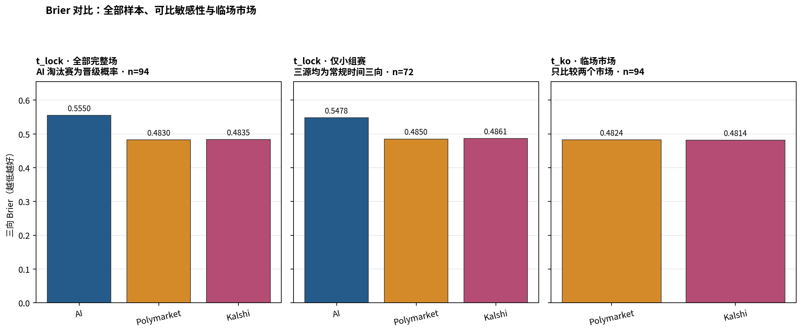
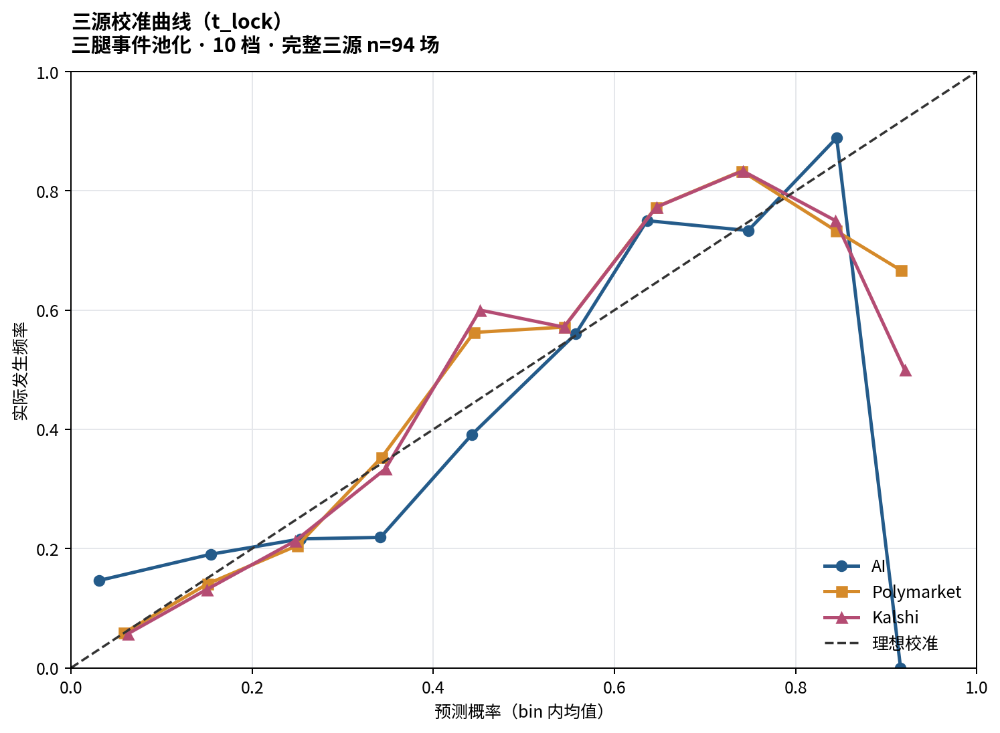

# 2026 世界杯三方预测准确度：AI vs Polymarket vs Kalshi

**研究范围**：截至 2026-07-10，账本中已完赛 96 场；完整三源、两时点样本 94 场。

---

## 结论先行

> **在 94 场完整样本的机械评分中，`t_lock` 的 Polymarket / Kalshi 明显优于 AI：Brier 约 0.483 对 0.555，AI−市场的 95% 配对 bootstrap 区间不跨 0。但总体 AI 差距混入了一个重要的目标定义错位；不能把它全部解释成模型本身更差。**
>
> - **同信息时点（`t_lock`）**：AI / Polymarket / Kalshi 的 Brier 分别为 **0.5550 / 0.4830 / 0.4835**，log-loss 分别为 **2.9715 / 0.8212 / 0.8230**。
> - **淘汰赛语义审计**：22 场淘汰赛的 AI locked 均为 **`p_draw=0` 的晋级概率**，却按任务要求用 90 分钟三向真值评分；其中 6 场 90 分钟平局令 AI log-loss 在 `1e-15` floor 下单场达到 34.54。因此总体 log-loss 尤其不可直接作三向模型能力比较。
> - **仅小组赛的可比敏感性**：三源都确实预测常规时间三向时，AI / PM / Kalshi Brier 为 **0.5478 / 0.4850 / 0.4861**（n=72）；AI−PM 为 **+0.0627**，95% CI **[+0.0169, +0.1093]**。这说明市场优势不只由淘汰赛错位制造，但总体效应量仍被错位放大。
> - **临场市场对市场（`t_ko`）**：Polymarket / Kalshi 的 Brier 为 **0.4824 / 0.4814**；PM−Kalshi 的配对差为 **+0.0009**，95% bootstrap CI **[-0.0016, +0.0033]**。
> - **AI 对市场（`t_lock`）**：AI−PM 为 **+0.0721**（95% CI **[+0.0206, +0.1240]**）；AI−Kalshi 为 **+0.0715**（95% CI **[+0.0206, +0.1239]**。差值为负表示左侧更准；区间跨 0 时应表述为“样本不足以确认差异”。
> - **这不是把 AI 与临场盘口硬比**：AI 在每日 06:00 UTC 左右锁定；主比较让市场也停在 06:10 UTC。`t_ko` 的市场额外吸收了当天新闻、伤停与首发名单等新信息，AI 无法使用这些信息，所以 `t_ko` 只回答“两个市场谁更准”，不回答“AI 是否不如临场市场”。

---

## 核心结果：同一信息集与临场市场必须分开读

| 比较口径 | 来源 | n | Brier ↓ | log-loss ↓ |
|---|---|---:|---:|---:|
| `t_lock` | AI | 94 | 0.5550 | 2.9715 |
| `t_lock` | Polymarket | 94 | 0.4830 | 0.8212 |
| `t_lock` | Kalshi | 94 | 0.4835 | 0.8230 |
| `t_ko` | Polymarket | 94 | 0.4824 | 0.8195 |
| `t_ko` | Kalshi | 94 | 0.4814 | 0.8201 |

Brier 图分成三个零基线面板：全部完整样本、仅小组赛的同目标敏感性、临场市场对市场。这样既保留任务要求的全赛事机械评分，也不把淘汰赛目标错位藏在总体均值里。



### 淘汰赛 AI 不是常规时间三向盘：小组赛敏感性更可比

完整样本含 22 场淘汰赛；这些场次 AI locked 的 `p_draw` 全为 0，口径实际是晋级概率。90 分钟真值中有 6 场平局，所以按三向 log-loss 机械评分会产生结构性惩罚。为保证全赛事流水账，本报告仍保留指定的总体指标；为回答模型能力问题，另报 72 场小组赛敏感性。

| 仅小组赛 `t_lock` | n | Brier | log-loss |
|---|---:|---:|---:|
| AI | 72 | 0.5478 | 0.9188 |
| Polymarket | 72 | 0.4850 | 0.8227 |
| Kalshi | 72 | 0.4861 | 0.8255 |

### 配对差与不确定性

| 配对差（左−右） | n | 均值 | 1000 次 bootstrap 95% CI |
|---|---:|---:|---:|
| PM−Kalshi @ `t_ko` | 94 | +0.0009 | [-0.0016, +0.0033] |
| AI−PM @ `t_lock` | 94 | +0.0721 | [+0.0206, +0.1240] |
| AI−Kalshi @ `t_lock` | 94 | +0.0715 | [+0.0206, +0.1239] |

负值表示左侧 Brier 更低。bootstrap 以比赛为重采样单位，保留同场三源的相关性；这是描述性不确定性区间，不是多重检验校正后的显著性声明。

### 校准：三腿事件池化只能看整体形状

每场的 home/draw/away 三个概率都作为一个二元事件进入 10 档可靠性曲线；因此每源共有 `3 × n` 个事件。空 bin 不插值，也不画虚构点。



---

## 分阶段结果：后期轮次样本很小

| stage | n | AI @ lock | PM @ lock | Kalshi @ lock | PM @ ko | Kalshi @ ko |
|---|---:|---:|---:|---:|---:|---:|
| group | 72 | 0.5478 | 0.4850 | 0.4861 | 0.4826 | 0.4827 |
| r32 | 15 | 0.6377 | 0.4813 | 0.4827 | 0.4887 | 0.4864 |
| r16 | 7 | 0.4528 | 0.4653 | 0.4589 | 0.4658 | 0.4576 |
| qf | 0 | — | — | — | — | — |

表中均为 Brier。`qf` 即使尚无完赛样本也保留为 0 行，避免把“尚未发生”误读为“数据缺失”。淘汰赛分层的 n 很小，不应据此给来源排位。

---

## 数据、时点与评分定义

- **比赛母表**：`web/public/data.json` 中 `completed == true` 的每场比赛；分析粒度是一场比赛。AI 使用 `locked.p_home/p_draw/p_away`，不从赛后字段重建预测。
- **`t_ko`**：官方账本开球时间减 5 分钟。Kalshi 的 `occurrence_datetime` 不用于开球时间。
- **`t_lock`**：开球 UTC 日 06:10；若开球早于 06:10，则使用前一日 06:10。这是对每日 06:00 AI 锁定 cron 留出 10 分钟后的可审计代理点。
- **市场价**：Kalshi 优先用有效 bid/ask 的 midpoint，任一侧缺失或为 0 时退回 candle close；Polymarket 使用 Yes token 最后一个 `t <= target` 的历史成交价。两者都不向后看，也不填充没有历史点的腿。
- **去 vig**：每源每场每时点把三腿除以原始三腿和。原始和完整保存在 `joined.csv`，汇总保存在 `accuracy.json`。AI 也重新归一，防止舍入误差。
- **真值**：只使用 Kalshi 三腿中唯一 settled `yes`，即常规时间三向结果。Brier 为 `Σ(p−y)²`，范围 0–2；log-loss 为 `−log(p_true)`。为输出有限 JSON，精确 0 的真实腿用 `1e-15` floor，报告同时单列这种结构性 0 的数量。
- **事件匹配审计**：Polymarket 94 场 `endDate` 与账本开球完全一致；2 场相差 −3600 秒（Mexico–Ecuador、Mexico–England），以唯一精确 moneyline 标题受控匹配，所有目标时刻仍只用账本 `kickoff_utc`。偏移明细保存在 `accuracy.json`。

### 原始三腿和（市场 overround / underround）

| 来源时点 | n | 均值 | 中位数 | 最小 | 最大 |
|---|---:|---:|---:|---:|---:|
| AI @ lock | 94 | 1.0000 | 1.0000 | 0.9999 | 1.0001 |
| PM @ lock | 94 | 1.0026 | 1.0050 | 0.9850 | 1.0150 |
| PM @ ko | 94 | 1.0010 | 1.0050 | 0.9850 | 1.0150 |
| Kalshi @ lock | 94 | 1.0053 | 1.0050 | 0.9750 | 1.0250 |
| Kalshi @ ko | 94 | 1.0048 | 1.0050 | 0.9850 | 1.0350 |

原始和大于 1 是正 overround，小于 1 是 underround；这张表描述三只独立二元合约合成三向盘时的总和，不等同于传统庄家固定抽水。

---

## Ground truth 交叉校验

完整样本中的小组赛共 **72** 场；Kalshi settled 常规时间结果与 `home_score/away_score` 推断结果不一致 **0** 场。

| 开球 | 比赛 | 比分 | 比分推断 | Kalshi | event |
|---|---|---:|---|---|---|
| — | 无不一致 | — | — | — | — |

淘汰赛不做比分反推，因为账本终场比分可能含加时或点球信息，不能可靠恢复 90 分钟三向结果。

---

## 缺数账本：96 场逐场互斥归类

归类优先级依次为 `缺 Kalshi → 缺 PM → 缺 AI locked → 价格时刻无数据`；这样每场恰好进入一类。若同场有多个问题，`diagnostic_reasons` 仍完整保留在 `accuracy.json`，不会因互斥汇总而丢失。

| 类别 | 场数 |
|---|---:|
| 完整三源 | 94 |
| 缺 Kalshi | 0 |
| 缺 PM | 0 |
| 缺 AI locked | 2 |
| 价格时刻无数据 | 0 |

### 逐场流水账

| # | 开球 UTC | 比赛 | stage | 互斥类别 | 全部诊断 |
|---:|---|---|---|---|---|
| 1 | 2026-06-11T19:00:00+00:00 | Mexico vs South Africa | group | 完整三源 | — |
| 2 | 2026-06-12T02:00:00+00:00 | South Korea vs Czech Republic | group | 完整三源 | — |
| 3 | 2026-06-12T19:00:00+00:00 | Canada vs Bosnia and Herzegovina | group | 完整三源 | — |
| 4 | 2026-06-13T01:00:00+00:00 | United States vs Paraguay | group | 完整三源 | — |
| 5 | 2026-06-13T19:00:00+00:00 | Qatar vs Switzerland | group | 完整三源 | — |
| 6 | 2026-06-13T22:00:00+00:00 | Brazil vs Morocco | group | 完整三源 | — |
| 7 | 2026-06-14T01:00:00+00:00 | Haiti vs Scotland | group | 完整三源 | — |
| 8 | 2026-06-14T04:00:00+00:00 | Australia vs Turkey | group | 完整三源 | — |
| 9 | 2026-06-14T17:00:00+00:00 | Germany vs Curaçao | group | 完整三源 | — |
| 10 | 2026-06-14T20:00:00+00:00 | Netherlands vs Japan | group | 完整三源 | — |
| 11 | 2026-06-14T23:00:00+00:00 | Ivory Coast vs Ecuador | group | 完整三源 | — |
| 12 | 2026-06-15T02:00:00+00:00 | Sweden vs Tunisia | group | 完整三源 | — |
| 13 | 2026-06-15T16:00:00+00:00 | Spain vs Cape Verde | group | 完整三源 | — |
| 14 | 2026-06-15T19:00:00+00:00 | Belgium vs Egypt | group | 完整三源 | — |
| 15 | 2026-06-15T22:00:00+00:00 | Saudi Arabia vs Uruguay | group | 完整三源 | — |
| 16 | 2026-06-16T01:00:00+00:00 | Iran vs New Zealand | group | 完整三源 | — |
| 17 | 2026-06-16T19:00:00+00:00 | France vs Senegal | group | 完整三源 | — |
| 18 | 2026-06-16T22:00:00+00:00 | Iraq vs Norway | group | 完整三源 | — |
| 19 | 2026-06-17T01:00:00+00:00 | Argentina vs Algeria | group | 完整三源 | — |
| 20 | 2026-06-17T04:00:00+00:00 | Austria vs Jordan | group | 完整三源 | — |
| 21 | 2026-06-17T17:00:00+00:00 | Portugal vs DR Congo | group | 完整三源 | — |
| 22 | 2026-06-17T20:00:00+00:00 | England vs Croatia | group | 完整三源 | — |
| 23 | 2026-06-17T23:00:00+00:00 | Ghana vs Panama | group | 完整三源 | — |
| 24 | 2026-06-18T02:00:00+00:00 | Uzbekistan vs Colombia | group | 完整三源 | — |
| 25 | 2026-06-18T16:00:00+00:00 | Czech Republic vs South Africa | group | 完整三源 | — |
| 26 | 2026-06-18T19:00:00+00:00 | Switzerland vs Bosnia and Herzegovina | group | 完整三源 | — |
| 27 | 2026-06-18T22:00:00+00:00 | Canada vs Qatar | group | 完整三源 | — |
| 28 | 2026-06-19T01:00:00+00:00 | Mexico vs South Korea | group | 完整三源 | — |
| 29 | 2026-06-19T19:00:00+00:00 | United States vs Australia | group | 完整三源 | — |
| 30 | 2026-06-19T22:00:00+00:00 | Scotland vs Morocco | group | 完整三源 | — |
| 31 | 2026-06-20T00:30:00+00:00 | Brazil vs Haiti | group | 完整三源 | — |
| 32 | 2026-06-20T03:00:00+00:00 | Turkey vs Paraguay | group | 完整三源 | — |
| 33 | 2026-06-20T17:00:00+00:00 | Netherlands vs Sweden | group | 完整三源 | — |
| 34 | 2026-06-20T20:00:00+00:00 | Germany vs Ivory Coast | group | 完整三源 | — |
| 35 | 2026-06-21T00:00:00+00:00 | Ecuador vs Curaçao | group | 完整三源 | — |
| 36 | 2026-06-21T04:00:00+00:00 | Tunisia vs Japan | group | 完整三源 | — |
| 37 | 2026-06-21T16:00:00+00:00 | Spain vs Saudi Arabia | group | 完整三源 | — |
| 38 | 2026-06-21T19:00:00+00:00 | Belgium vs Iran | group | 完整三源 | — |
| 39 | 2026-06-21T22:00:00+00:00 | Uruguay vs Cape Verde | group | 完整三源 | — |
| 40 | 2026-06-22T01:00:00+00:00 | New Zealand vs Egypt | group | 完整三源 | — |
| 41 | 2026-06-22T17:00:00+00:00 | Argentina vs Austria | group | 完整三源 | — |
| 42 | 2026-06-22T21:00:00+00:00 | France vs Iraq | group | 完整三源 | — |
| 43 | 2026-06-23T00:00:00+00:00 | Norway vs Senegal | group | 完整三源 | — |
| 44 | 2026-06-23T03:00:00+00:00 | Jordan vs Algeria | group | 完整三源 | — |
| 45 | 2026-06-23T17:00:00+00:00 | Portugal vs Uzbekistan | group | 完整三源 | — |
| 46 | 2026-06-23T20:00:00+00:00 | England vs Ghana | group | 完整三源 | — |
| 47 | 2026-06-23T23:00:00+00:00 | Panama vs Croatia | group | 完整三源 | — |
| 48 | 2026-06-24T02:00:00+00:00 | Colombia vs DR Congo | group | 完整三源 | — |
| 49 | 2026-06-24T19:00:00+00:00 | Bosnia and Herzegovina vs Qatar | group | 完整三源 | — |
| 50 | 2026-06-24T19:00:00+00:00 | Switzerland vs Canada | group | 完整三源 | — |
| 51 | 2026-06-24T22:00:00+00:00 | Morocco vs Haiti | group | 完整三源 | — |
| 52 | 2026-06-24T22:00:00+00:00 | Scotland vs Brazil | group | 完整三源 | — |
| 53 | 2026-06-25T01:00:00+00:00 | Czech Republic vs Mexico | group | 完整三源 | — |
| 54 | 2026-06-25T01:00:00+00:00 | South Africa vs South Korea | group | 完整三源 | — |
| 55 | 2026-06-25T20:00:00+00:00 | Curaçao vs Ivory Coast | group | 完整三源 | — |
| 56 | 2026-06-25T20:00:00+00:00 | Ecuador vs Germany | group | 完整三源 | — |
| 57 | 2026-06-25T23:00:00+00:00 | Japan vs Sweden | group | 完整三源 | — |
| 58 | 2026-06-25T23:00:00+00:00 | Tunisia vs Netherlands | group | 完整三源 | — |
| 59 | 2026-06-26T02:00:00+00:00 | Paraguay vs Australia | group | 完整三源 | — |
| 60 | 2026-06-26T02:00:00+00:00 | Turkey vs United States | group | 完整三源 | — |
| 61 | 2026-06-26T19:00:00+00:00 | Norway vs France | group | 完整三源 | — |
| 62 | 2026-06-26T19:00:00+00:00 | Senegal vs Iraq | group | 完整三源 | — |
| 63 | 2026-06-27T00:00:00+00:00 | Cape Verde vs Saudi Arabia | group | 完整三源 | — |
| 64 | 2026-06-27T00:00:00+00:00 | Uruguay vs Spain | group | 完整三源 | — |
| 65 | 2026-06-27T03:00:00+00:00 | Egypt vs Iran | group | 完整三源 | — |
| 66 | 2026-06-27T03:00:00+00:00 | New Zealand vs Belgium | group | 完整三源 | — |
| 67 | 2026-06-27T21:00:00+00:00 | Croatia vs Ghana | group | 完整三源 | — |
| 68 | 2026-06-27T21:00:00+00:00 | Panama vs England | group | 完整三源 | — |
| 69 | 2026-06-27T23:30:00+00:00 | Colombia vs Portugal | group | 完整三源 | — |
| 70 | 2026-06-27T23:30:00+00:00 | DR Congo vs Uzbekistan | group | 完整三源 | — |
| 71 | 2026-06-28T02:00:00+00:00 | Algeria vs Austria | group | 完整三源 | — |
| 72 | 2026-06-28T02:00:00+00:00 | Jordan vs Argentina | group | 完整三源 | — |
| 73 | 2026-06-28T19:00:00+00:00 | South Africa vs Canada | r32 | 完整三源 | — |
| 74 | 2026-06-29T17:00:00+00:00 | Brazil vs Japan | r32 | 完整三源 | — |
| 75 | 2026-06-29T20:30:00+00:00 | Germany vs Paraguay | r32 | 完整三源 | — |
| 76 | 2026-06-30T01:00:00+00:00 | Netherlands vs Morocco | r32 | 完整三源 | — |
| 77 | 2026-06-30T17:00:00+00:00 | Ivory Coast vs Norway | r32 | 完整三源 | — |
| 78 | 2026-06-30T21:00:00+00:00 | France vs Sweden | r32 | 完整三源 | — |
| 79 | 2026-07-01T02:00:00+00:00 | Mexico vs Ecuador | r32 | 缺 AI locked | 缺 AI locked |
| 80 | 2026-07-01T16:00:00+00:00 | England vs DR Congo | r32 | 完整三源 | — |
| 81 | 2026-07-01T20:00:00+00:00 | Belgium vs Senegal | r32 | 完整三源 | — |
| 82 | 2026-07-02T00:00:00+00:00 | United States vs Bosnia and Herzegovina | r32 | 完整三源 | — |
| 83 | 2026-07-02T19:00:00+00:00 | Spain vs Austria | r32 | 完整三源 | — |
| 84 | 2026-07-02T23:00:00+00:00 | Portugal vs Croatia | r32 | 完整三源 | — |
| 85 | 2026-07-03T03:00:00+00:00 | Switzerland vs Algeria | r32 | 完整三源 | — |
| 86 | 2026-07-03T18:00:00+00:00 | Australia vs Egypt | r32 | 完整三源 | — |
| 87 | 2026-07-03T22:00:00+00:00 | Argentina vs Cape Verde | r32 | 完整三源 | — |
| 88 | 2026-07-04T01:30:00+00:00 | Colombia vs Ghana | r32 | 完整三源 | — |
| 89 | 2026-07-04T17:00:00+00:00 | Canada vs Morocco | r16 | 完整三源 | — |
| 90 | 2026-07-04T21:00:00+00:00 | Paraguay vs France | r16 | 完整三源 | — |
| 91 | 2026-07-05T20:00:00+00:00 | Brazil vs Norway | r16 | 完整三源 | — |
| 92 | 2026-07-06T01:00:00+00:00 | Mexico vs England | r16 | 缺 AI locked | 缺 AI locked |
| 93 | 2026-07-06T19:00:00+00:00 | Portugal vs Spain | r16 | 完整三源 | — |
| 94 | 2026-07-07T00:00:00+00:00 | United States vs Belgium | r16 | 完整三源 | — |
| 95 | 2026-07-07T16:00:00+00:00 | Argentina vs Egypt | r16 | 完整三源 | — |
| 96 | 2026-07-07T20:00:00+00:00 | Switzerland vs Colombia | r16 | 完整三源 | — |

`joined.csv` 只含“完整三源”行，所以其行数必须且已经断言等于上表的完整三源场数；其余比赛没有进入任何准确度均值。不存在补值。

---

## 诚实的局限

1. **信息集不同是核心限制，不是脚注。** 市场在 `t_lock` 后仍持续吸收新信息，例如伤停确认、当天状态、天气变化和首发名单；AI 锁定后无法使用这些信息。因此 AI 与市场的公平比较锚定 `t_lock`，而 `t_ko` 只比较两个市场。即使临场市场 Brier 更低，也不能把全部差值解释成模型结构更优。
2. **历史价不等于无限流动性的可成交价。** Kalshi midpoint 可能来自很宽的 bid/ask，退回 close 时则是最后成交；Polymarket 历史 API给最后成交价而非同步盘口 midpoint。去 vig 修正了三腿总和，却不能消除价差、陈旧成交或深度差异。
3. **完整案例分析可能有选择偏差。** 任一事件、腿、锁定预测或目标时点价格缺失都会整场排除。缺数账本使排除透明，但不能保证完整样本与缺失样本可交换。
4. **96 场仍是小样本，淘汰赛尤其小。** 配对 bootstrap 区间反映当前比赛集合上的采样不确定性；它不是未来世界杯的外推保证，也没有对多个阶段/来源比较做 family-wise 校正。
5. **Kalshi 是真值源也是被评估源。** settled result 是离散赛果，不使用其价格，所以没有机械泄漏；但若平台结算规则或个别 market 映射错误，会同时影响标签与 Kalshi 行。小组赛比分交叉校验用于发现这类问题，淘汰赛只能人工核对 market 文本与 settled 腿。
6. **校准曲线把三腿池化。** home/draw/away 的基准率和难度不同，池化图适合总体诊断，不等同于每一腿分别校准；每 bin 样本也相互依赖，因为同一场贡献三个事件。
7. **这是一届赛事的回测，不是投注建议。** 球队构成、市场参与者和模型版本都随时间变化；点估计差异不能直接转换成未来收益。

---

## 下一步

- 赛事继续后，用同一脚本追加 QF/SF/final，保持时点和缺数规则不变，避免事后改口径。
- 若要研究可交易性，另存目标时点价差、深度和最近成交距目标时点的 age；准确度与执行成本应分开报告。
- 样本扩大后补充 outcome-specific 校准与按成交活跃度的敏感性分析；在当前 n 下不把小分层噪声包装成稳定结论。

## 可复现运行

```bash
/home/ubuntu/worldcup-oracle/venv/bin/python research/market_accuracy/01_fetch_kalshi.py
/home/ubuntu/worldcup-oracle/venv/bin/python research/market_accuracy/02_fetch_polymarket.py
/home/ubuntu/worldcup-oracle/venv/bin/python research/market_accuracy/03_analyze.py
```

两个 fetch 脚本访问网络并覆写各自 JSON；`03_analyze.py` 只读本地三个输入文件。所有 JSON 使用固定字段结构，分析 bootstrap 随机种子固定为 42。
