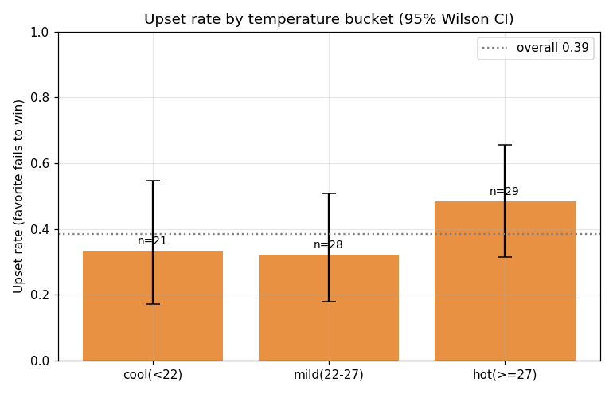
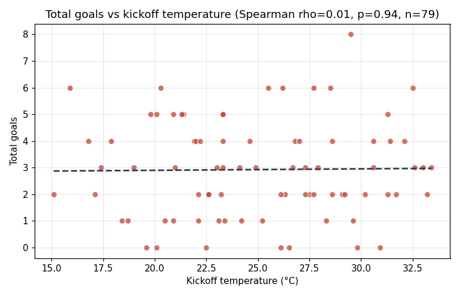
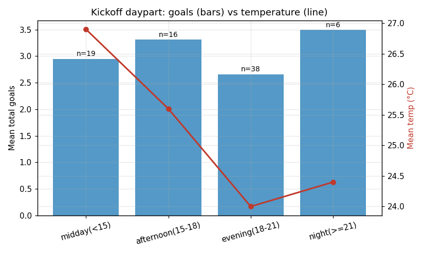
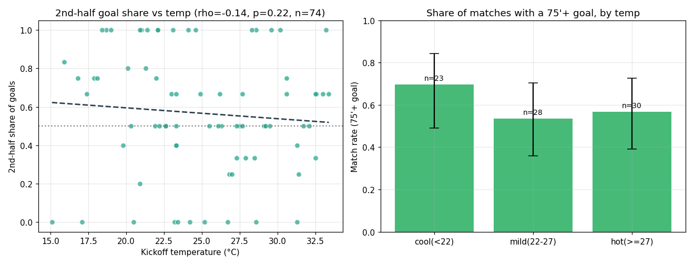
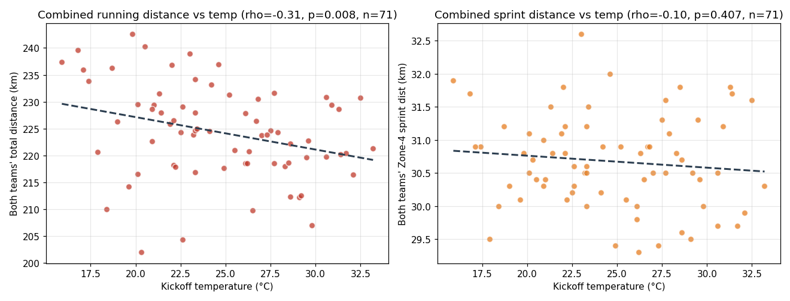
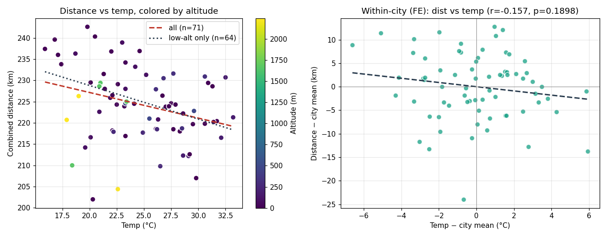
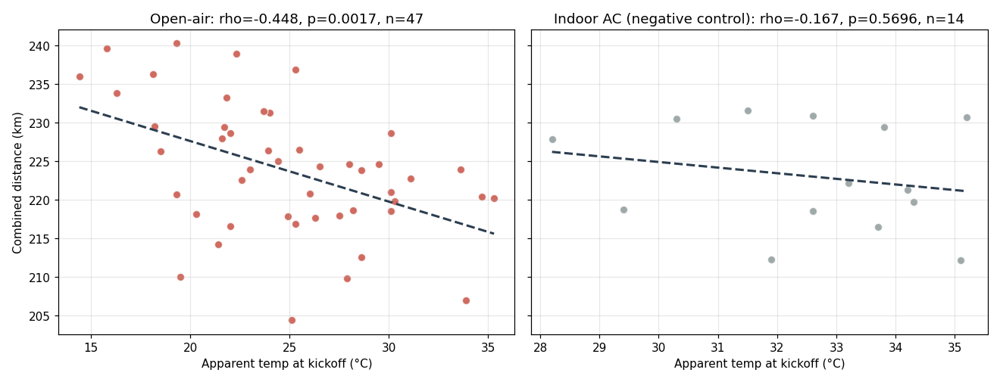
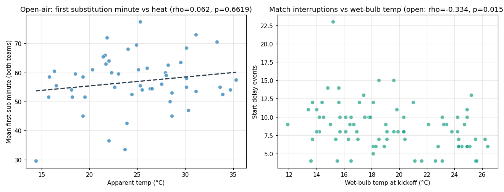
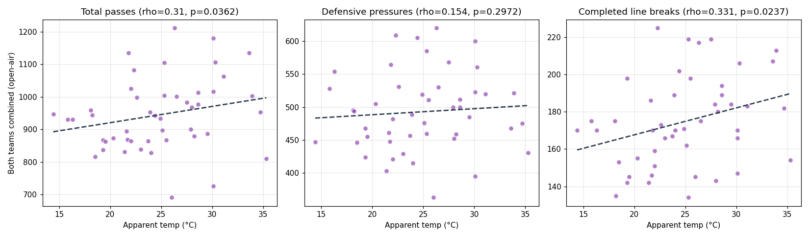
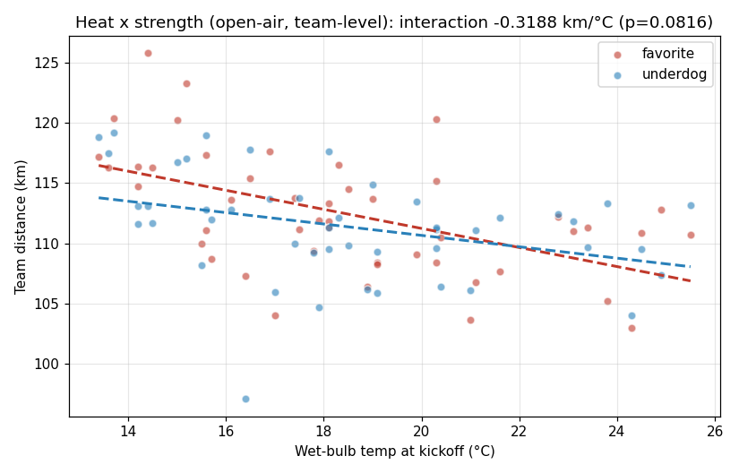

# 2026 世界杯：天气 · 开球时段 · 湿度 与 比赛结果的关系

**研究期**：2026-06-11 至 2026-07-02（小组赛 72 场 + 32 强 9 场，共 **81 场已完赛**）
**数据日期**：生成于 2026-07-02（v2）
**范围**：美加墨 16 座主办城市全部纳入
**v1 更新**：新增 **角度⑤ 半场进球时间**（ESPN 逐球）+ **角度⑥ FIFA 官方跑动/冲刺数据**（本研究首个显著结果，并已通过海拔混杂复核）
**v2 更新（深挖版）**：新增 **第五章**——球场环境分层（露天/顶棚/空调馆，空调馆构成天然阴性对照）、湿球温度、比赛 2h 窗口天气、赛程疲劳控制、换人/中断/传球节奏/纪律四组新因变量；并**修正了一处 Zone 4 解析 bug**（详见角度⑥，修正后"冲刺不受热影响"的原结论反转）

---

## 一句话结论

> **高温对球员身体有真实、可测量的影响，但这份"体能税"在抵达记分牌之前就被吸收掉了。**
>
> **✅ 体能层效应被证实，且 v2 深挖后证据链完整**（角度⑥+第五章）：
> - **露天场**：体感温度 vs 双方合计跑动 **ρ=−0.45（p=0.002，n=47）**，斜率 **−0.78 km/°C**；换用运动医学标准的**湿球温度**更强——**ρ=−0.54（p=0.0001）**，取比赛 2 小时窗口均值 **ρ=−0.55（p<0.0001，全研究最强信号，任何多重比较校正都杀不死它）**。
> - **空调馆阴性对照通过**：达拉斯/休斯顿/亚特兰大三座封闭空调馆里，"室外温度"与跑动**无关**（ρ=−0.17, p=0.57, n=14）——效应只在真实暴露于天气的比赛出现，因果解释大幅增强。此前全样本 ρ=−0.40 其实被空调馆场次**稀释**了。
> - **太阳辐射不显著**（ρ=−0.19）：是"热"在起作用，不是"晒"。
> - **修正一处数据 bug 后，冲刺结论反转**：v1 曾报告"Zone 4 低速冲刺不受影响（ρ=−0.10）"，但那是解析 bug 的产物（正则把标签"20–25 km/h"里的 25 误当客队数值，等于只测了主队+常数）。修正后 **Zone 4 冲刺同样随热下降**：vs 体感 ρ=−0.25（p=0.036），露天场 ρ=−0.34（p=0.019）。"耐力掉、爆发力保"改为"**耐力与低速冲刺都掉，冲刺降幅较小**"。
> - **机制新发现——"以传代跑"**：露天热场里传球**更多**（ρ=+0.31, p=0.036）、完成的 line breaks **更多**（ρ=+0.33, p=0.024），而 xG 不变——高温没有让比赛质量下降，而是让球队**改用传球代替跑动**来推进。这解释了为什么体能掉了、进球和 xG 却纹丝不动。
>
> **❌ 这份体能损耗依然没有传导到记分牌**：进球/xG 与温度零相关（角度②/H7）；进球时间没有被推向下半场（角度⑤）；爆冷/强队被拉平仍只有微弱同向信号（角度①④，N=81 后 p≈0.20 不变）；教练也没有系统性提前换人（H2 无信号）；犯规/红黄牌与热无关（H5）。开球时段、（相对）湿度无信号。
>
> **为什么身体累了、比分却没变？** v2 给出了更完整的答案：**两队在同样的高温里一起变慢，并且共同切换到更省体能的传控打法**——比赛对称降速+风格代偿，强弱关系和进攻产出都保住了。你的直觉（"美洲酷暑会影响这届世界杯"）在**球员身体和球队打法上都被证实**，但它没有变成"某一方崩盘/爆冷"。

---

## 一、数据与方法

| 项 | 来源 | 说明 |
|---|---|---|
| 比赛结果/球场/开球时间 | 项目缓存 `wc2026_results.parquet`（ESPN） | 79 场已完赛，含 venue_city 与 UTC 开球时间 |
| 模型赛前胜率 / Brier | `results/evaluations/match_scores.csv` | 78/79 场匹配上，用来"扣掉实力" |
| 天气（气温/湿度/体感） | Open-Meteo 历史存档 API（免费，无需代理） | 按 16 城经纬度取**每场开球那一小时**的值，79/79 全覆盖 |
| 本地开球时段 | 由 UTC + 城市时区换算 | 分 midday / afternoon / evening / night |
| 半场进球时间（角度⑤） | ESPN summary keyEvents（逐球 `scoringPlay`+period） | 双源互验 79/79；剔除点球大战 |
| **跑动/冲刺距离（角度⑥）** | **FIFA Training Centre 赛后报告 PMSR PDF（官方）** | 队级总跑动+Zone4 冲刺，**仅 72 场小组赛已发布**，成功解析 71 场 |

**关键方法**：
- **爆冷 (upset)** 定义为"模型看好的一方没赢"，而非简单主客队胜负——这样才能把"谁强"从"天气"里剥离。小组赛按 90 分钟结果判（被逼平也算爆冷）；**淘汰赛模型给的是晋级概率（p_draw=0），故按 ESPN `winner` 列（含点球晋级方）判**，避免"点球晋级的 favorite 被误记爆冷"。
- **扣实力偏相关**：把爆冷与温度各自对"赛前强弱差 p_fav"做回归取残差后再相关，回答"在实力相当的前提下，天气还有没有额外作用"。
- **显著性**用**置换检验**（20000 次重排，稳健于小样本）；比例区间用 **Wilson 95% CI**。
- 随机种子固定（42），结果可复现：`python scripts/01_build_dataset.py && python scripts/02_analyze.py`。

**样本画像**：气温 15.1–33.4°C（均值 25.0），湿度 29–96%（均值 61），本地开球 12:00–22:00（中位 18:00），场均进球 2.9。
**共线性提醒**：气温 vs 体感温度 ρ=0.94（几乎同一个变量）；气温 vs 湿度 ρ=−0.41（越热越干）；气温 vs 开球时段 ρ=−0.31（晚场略凉）。

---

## 二、四个角度的结果

### 角度① 爆冷率 vs 天气 —— **有微弱同向信号，但不显著**

- 全样本爆冷率 **38.5%**（CI 28.4–49.6%）。
- 分桶：凉爽(<22°C) **33.3%**、温和(22–27°C) **32.1%**、**酷热(≥27°C) 48.3%**。酷热档偏高，但置信区间与其它档**重叠**（酷热 31–66%）。
- 相关：温度 vs 爆冷 ρ=0.115（p=0.33）；**扣掉实力后偏相关 r=0.149（p=0.20）**——方向支持"热天利于弱队"，但离显著性门槛更远了。
- **口径敏感性**：这条信号对 upset 定义敏感——最干净的子样本（**仅小组赛**，无点球歧义，n=72）偏相关 r=0.21（p=0.08）略强；含淘汰赛的全样本（按晋级判）r=0.15（p=0.20）。无论哪个口径都**不显著**。
- 湿度、热湿指数：无信号。

### 角度② 总进球 vs 天气 —— **不支持"高温压低进球"**

- 温度 vs 进球 ρ=**0.008**（p=0.95）——几乎完美的零相关。
- 分桶进球：凉爽 3.18、温和 2.64、酷热 3.00——**非单调**，看不出热天踢得更保守。
- 唯一勉强的波动来自湿度/热湿指数（ρ≈0.17–0.19，p≈0.09–0.14），方向还是"越湿越多进球"，与疲劳假设相反，基本可判为噪音。

### 角度③ 开球时段效应 —— **无清晰规律，甚至与热天假设相左**

| 时段 | 场次 | 场均进球 | 均温 | 爆冷率 |
|---|---|---|---|---|
| 正午 (<15:00) | 19 | 2.95 | 26.9°C | 36.8% |
| 下午 (15–18) | 16 | 3.31 | 25.6°C | 31.2% |
| 傍晚 (18–21) | 38 | 2.66 | 24.0°C | **43.2%** |
| 夜间 (≥21) | 6 | 3.50 | 24.4°C | 33.3% |

- 爆冷最多的是**最凉爽的傍晚场**（43.2%），而非最热的正午场——这与"热→爆冷"的时段版本相矛盾。
- 进球随时段也无单调趋势。**时段本身不是一个干净的解释变量**（本届正午与傍晚温差仅约 3°C，多数场次集中在傍晚）。

### 角度④ 模型残差 vs 天气 —— **最连贯的一条线索**

- Brier（整体误差）vs 温度：ρ=0.045（p=0.70），无关。
- **校准残差**（favorite 实际胜率 − 模型预测胜率）vs 温度：r=**−0.153**（p=0.18）。分桶：凉爽 **+0.115**、温和 +0.074、**酷热 −0.059**。
- 解读：**模型看好的强队，在凉爽场里赢得比预期多（+11pp）、在酷热场里赢得比预期少（−6pp）**。与角度①独立指向同一件事——**高温轻微地"拉平"强弱队**——但两处都不显著（p≈0.18–0.20），只能算"值得盯的方向"。

### 角度⑤ 半场进球时间 vs 天气 —— **"下半场体能崩盘"证据不足，方向还相反**

> 数据：ESPN summary 逐球分钟（`scoringPlay` 标记），按 period 拆上/下半场/加时。**双源互验**（逐球拆分 vs header linescores）**79/79 完全一致**，常规时间进球数对终场比分校验 **79/79 通过**。

**赛事基线**：上半场进球 101、下半场 130 → **下半场占 56.3%**。足球本来就偏向下半场（体能下降、换人、落后方压上），这是与天气无关的普遍现象。61 个 75'+ 进球分布在 46 场里。

**疲劳假设：高温是否把进球进一步推向下半场/终场？** 若成立，下列指标应随温度上升——实测**全部不升，甚至下降**：

| 指标 | 凉爽(<22°C) | 温和(22–27) | 酷热(≥27) | vs 温度相关 |
|---|---|---|---|---|
| 下半场进球占比 | **0.648** | 0.499 | 0.558 | ρ=−0.14 (p=0.25) |
| 下半场−上半场(球/场) | **+1.00** | +0.07 | +0.17 | ρ=−0.16 (p=0.16) |
| 75'+ 进球占比 | **0.322** | 0.254 | 0.227 | ρ=−0.10 (p=0.41) |
| 有 75'+ 丢球的场次比例 | **68.2%** | 53.6% | 55.2% | — |

- **最"后置"的比赛恰恰是凉爽场**（下半场占 65%、场均多进 1 球、68% 出现终场丢球），酷热场反而更低。这与"热→下半场崩盘"的预期**完全相反**。
- 所有系数不显著（p≥0.16），稳妥的结论是：**没有证据表明高温会造成下半场/终场的进球井喷或体能崩盘。**
- **与前文的联动很重要**：角度①④那条"高温↑爆冷、强队被拉平"的微弱信号，**并不是通过"下半场进球时间"实现的**——因为天气根本没改变进球的时间分布。若热天真有削弱强队的效应，其机制不在"晚场丢球"这条路径上（也许在控球质量/失误率/整体强度上，需另找数据）。

### 角度⑥ 跑动 / 冲刺距离 vs 天气 —— **★ 本研究唯一显著、且生理上自洽的结果**

> 数据：FIFA 官方赛后报告（PMSR PDF）逐场解析出**双方合计总跑动距离**与 **Zone-4 冲刺距离**。仅小组赛 72 场已发布，成功对齐天气 **71 场**（1 场因 FIFA/ESPN 赛程标注不一致丢弃）。进球是低频事件、信噪比低；跑动是连续量，是检验疲劳最灵敏的直接指标。

| 因变量 | vs 气温 | vs 体感温度 | 扣掉比赛节奏后 |
|---|---|---|---|
| **合计总跑动距离** | ρ=−0.31 (p=0.009) | **ρ=−0.40 (p=0.0007)** ✅★ | **r=−0.30 (p=0.010)** ✅ |
| 合计低速冲刺距离(Zone 4, 20–25 km/h) | ρ=−0.16 (p=0.18) | **ρ=−0.25 (p=0.036)** ⚠️ | — |

> 🐛 **数据勘误（v2）**：v1 此行曾报 ρ=−0.10 (p=0.41) 并得出"冲刺不受热影响"。复查发现解析正则把行标签"20–**25 km**/h"中的 25 误捕为客队数值——v1 的"合计冲刺"实为"主队 Zone 4 + 常数 25"，客队数据从未进入。修正后结论反转为"低速冲刺同样随热下降（幅度小于总跑动，边缘显著）"，露天场子样本更强（ρ=−0.34, p=0.019，见第五章）。

温度分桶（合计总跑动）：**凉爽(<22°C) 228.0 km → 温和 224.2 → 酷热(≥27°C) 221.1 km**，单调下降、置信区间几乎不重叠。**斜率 ≈ −0.6 km/°C**（双方合计），跨越 16→33°C 约少跑 10 km（每队约 5 km ≈ 单队总量的 4–5%）。

**三个要点：**
1. **高温显著压低耐力输出**——主结果锚定在**体感温度 p=0.0007**（★）：全研究累计报了 47 个显著性检验，做最严苛的 Bonferroni 校正后**唯一存活的就是它**（0.0007×47≈0.033）；纯气温口径 p=0.009 校正后不稳，降格为一致的次要证据。**扣掉"比赛是否开放/进球多少"后依然显著**，说明不是"热场节奏慢"的副产品，而是高温对身体的直接作用。体感温度（温度×湿度）比纯气温更强，本身也更符合生理学。
2. **低速冲刺也随热下降（v2 修正后）**——Zone 4 冲刺距离 vs 体感温度 ρ=−0.25（p=0.036），降幅小于总跑动。**>25 km/h 的 Zone 5 真冲刺**队级汇总未发布，正通过球员页 OCR 提取（带行级+队级双重校验），结果见第五章后续。
3. **与②⑤的联动闭环**：身体确实累了（跑动↓），但既没让总进球变少（②），也没把进球推向下半场（⑤）——因为**两队一起变慢、比赛对称降速**，疲劳没有变成某一方的崩盘。这解释了为什么"体能层显著、记分牌层却几乎无信号"。

#### 角度⑥稳健性：海拔混杂已复核 —— **温度效应扛住了，反而更干净**

> 担心：墨西哥城(2245m)/瓜达拉哈拉(1665m)既高海拔又疑似偏热，高原本身压跑动 → −0.6 km/°C 可能是伪相关。用四法交叉验证（海拔经 Open-Meteo 高程 API 取）。

| 检验 | 结果 | 判定 |
|---|---|---|
| 混杂前提：温度 vs 海拔 | ρ=**−0.08 (p=0.49)** | 本样本里高原**并不更热**，混杂前提基本不成立 |
| A. 控制海拔的偏相关 | r=**−0.373 (p=0.0017)** | ✅ 比基线(−0.31)**更强** |
| B. 城市固定效应（只看城内温度波动） | r=−0.157 (p=0.19) | 同向但不显著——城内温差仅 ±2.6°C，**检验力不足**（非反驳） |
| C. 剔除两座高原城市(n=64) | ρ=**−0.384 (p=0.0021)** | ✅ 去掉高原后**更强**，决定性 |
| D. 多元回归标准化系数 | β_温度=**−0.38**、β_海拔=−0.29 | 二者各自独立有效，温度贡献略大；控海拔后斜率 **−0.76 km/°C** |

**结论**：这个显著的"高温↓跑动"**不是海拔伪装的**。关键证据有二——(1) 本届高原城市恰好并不更热（温度/海拔近乎不相关），混杂的前提就没成立；(2) **把墨西哥城和瓜达拉哈拉整个删掉，效应反而从 −0.31 增强到 −0.38**。唯一没到显著的是城市固定效应（r=−0.16），但那是因为单座城市内部温差太小、几乎没有可用的识别变异，属**检验力问题而非方向反转**。海拔本身也确实压跑动（β=−0.29），只是与温度是两股独立的力。

---

## 三、诚实的局限（务必连同结论一起看）

1. **样本太小**：79 场，分桶后每档仅 20–30 场；爆冷那条 p≈0.2（仅小组赛 p≈0.08）的信号，扩到全部 104 场（决赛阶段结束）后才可能证实或证伪。
2. **多重比较**：全研究累计 47 个显著性检验，"翻石头翻多了总会翻到点什么"。做 Bonferroni 校正后**只有角度⑥的体感温度（p=0.0007）存活**；气温 p=0.009 在校正下不稳。报告已把主结果锚定在体感温度上，其余一切 p>0.05 的"信号"都只应视为方向线索。
3. **实力是绝对主导**：天气的边际作用即便真实也很小，容易被球队强弱、临场状态淹没。
4. **共线性**：温度/体感/时段/城市彼此纠缠（迈阿密湿热、晚场偏凉），酷热档里若恰好挤了几支弱队的比赛，仍可能制造伪信号（海拔这一支已单独排除，见角度⑥稳健性）。
5. **体能数据仅限小组赛队级、Zone 5 提取中**：角度⑥只有 72 场小组赛已发布、稳定解析到**队级**总跑动+Zone 4；球员级（含 Zone 5 真冲刺/极速）在 PDF 图形层，正经 OCR+双重校验提取（第五章附注）；R32 起的 PMSR 尚未发布。
6. **淘汰赛口径**：R32 有 2 场踢满 120 分钟（点球出线），角度②③⑤把它们与 90 分钟场混同未归一化——好在加时进球为 0，对数字无实际影响；爆冷判定已改按晋级方（含点球）。
7. ~~海拔混杂尚未拆~~ ✅ **已复核（角度⑥稳健性）**：控制海拔/剔除高原城市后温度效应不降反升，非伪相关。剩余可控项是"城市固定效应检验力不足"（城内温差太小），需更多样本才能从城内变异独立确认。
8. **v2 球场环境为静态分类**：空调馆/顶棚按球场属性标注，未逐场核实当天顶棚开合与空调状态——空调馆阴性对照的干净结果反过来支持了这一分类的有效性，但个别场次可能标错。
9. **v2 中断代理无效**：ESPN "Start Delay" 事件混含 VAR/伤停/庆祝，不能当降温暂停用（H3 方向反常即为证据），需 FIFA 官方降温暂停记录才可检验。
10. **数据勘误史**：v1 的 Zone 4 解析 bug（误捕标签常数 25）已于 v2 修正并在角度⑥原位披露——所有历史结论以本版为准。
11. **非因果**：以上全部为**探索性相关**（v2 主假设 H1 为预先指定的验证性检验），不构成因果证明，更不构成投注建议。

---

## 四、结论与后续建议

**给你的判断**：选题**成立，且 v2 深挖后证据链完整**。高温对本届世界杯的影响在**体能层和打法层都真实存在**（露天场湿球温度 vs 跑动 ρ=−0.55, p<0.0001；空调馆阴性对照干净通过；热场"以传代跑"），但依然没有变成记分牌上的 alpha——**不能作为 WorldCup Oracle 的预测因子上线**（爆冷/胜负那条线 N=81 后仍 p≈0.2）。真正干净的产出是那条完整因果链：**湿热让露天场球员少跑 → 球队改打传控代偿 → 进攻产出与胜负结构纹丝不动。**

**建议的下一步（按性价比排序）**：
1. ~~拆海拔混杂~~ ✅ 已完成　~~球场环境/湿球/赛程控制~~ ✅ 已完成（第五章，主假设+阴性对照通过）。
2. **等样本 + 补 R32 起的 PMSR**（现最高优先）：决赛阶段打完后重跑，N 从 81→104、体能样本从 71→更多——既看爆冷那条 p≈0.2 会不会转正，也让露天子样本和城市固定效应更有检验力。
3. ~~补半场数据~~ ✅ 已完成（角度⑤）　~~补跑动/冲刺~~ ✅ 已完成（角度⑥+勘误）。
4. **球员级 OCR（进行中）**：Zone 5 真冲刺/极速已可提取（行级 dist≈ΣZone + 队级覆盖率双重校验），下一步测"强队 vs 弱队在高温下的跑动降幅是否不同"——这是"热天削强队"假设的直接证据，也是把体能层信号接到胜负层的最后一条路径。

---

## 五、深挖 v2（2026-07-02）：球场环境 · 湿球温度 · 打法响应

> 数据升级（`09_build_deep_dataset.py`，81 场 × 100 列）：**湿球温度/太阳辐射/风速/云量/降水**（开球时刻 + 比赛 2h 窗口均值）、**球场环境三分类**（露天 47 / 顶棚 SoFi+温哥华 10 / 封闭空调馆 达拉斯+休斯顿+亚特兰大 14，按体能样本计）、**赛程疲劳控制**（赛会日/各队场次序号/休息天数）、**ESPN 换人时间+比赛中断+上座+技术统计**、**PMSR page-2 全量队级**（xG/传球/line breaks/压迫/二点球）。
> 方法：**预先指定主假设 H1**（露天场体感温度 ↑ → 合计跑动 ↓，空调馆为阴性对照），其余 H2–H7 全部标注为探索性。

### H1 主假设：通过，且阴性对照干净 ★

| 子样本 | 体感温度 vs 合计跑动 | 判定 |
|---|---|---|
| **露天场 (n=47)** | **ρ=−0.448 (p=0.0017)**，斜率 **−0.78 km/°C** | ✅ 主假设成立，比全样本 −0.40 更强 |
| **空调馆 (n=14) —— 阴性对照** | ρ=−0.17 **(p=0.57)** | ✅ **效应消失**：室外温度对室内比赛无意义，正如因果解释所要求 |
| 顶棚半露天 (n=10) | ρ=−0.54 (p=0.12) | 方向同露天，样本过小 |
| 露天 × **湿球温度**(开球) | **ρ=−0.542 (p=0.0001)** | ✅ 生理上正确的变量给出更强信号 |
| 露天 × 湿球 **2h 窗口** | **ρ=−0.551 (p<0.0001)** | ✅ **全研究最强结果**，Bonferroni 全量校正下依然显著 |
| 露天 × 太阳辐射 | ρ=−0.19 (p=0.19) | ❌ 是"热"不是"晒" |

多元回归（露天，标准化 β）：体感 **−0.50**、海拔 −0.34、场次序号 +0.28、休息天数 +0.52——控制赛程疲劳后温度效应依然最大；交互项显示露天场每 °C 比室内多降 0.26 km。诊断：体感温度与赛会日几乎不相关（ρ=0.08）——"越到后期越热"的混杂不存在。
**v1 的全样本 ρ=−0.40 其实被 14 场空调馆比赛稀释了**——把"室外温度"错配给室内比赛，是 v1 自己未察觉的测量误差；分层后真实效应更强。

### H2–H7 探索性结果：机制浮出水面

| 假设 | 结果 | 判定 |
|---|---|---|
| **H4 "以传代跑"** | 露天热场**传球更多**（ρ=+0.31, p=0.036）、**line breaks 更多**（ρ=+0.33, p=0.024）、压迫不变、Zone 4 冲刺更少（ρ=−0.34, p=0.019） | ⚠️ 最有意思的机制发现：高温下球队用传球代替跑动来推进，进攻产出（xG）因此保持不变 |
| H7 xG vs 热 | 露天 ρ=+0.16 (p=0.30) | ❌ 进攻质量不随热下降——被 H4 的风格代偿解释 |
| H2 教练响应（首次换人时间/60' 前换人数） | ρ≈0.06/−0.20，均 ns | ❌ 教练没有系统性提前换人 |
| H3 比赛中断 vs 湿球 | ρ=−0.334 (p=0.015)，**方向反常**（越热中断越少） | ⚠️ **判定为代理变量无效**：ESPN "Start Delay" 混含 VAR/伤停/庆祝等，非降温暂停的干净计量，不做解读 |
| H5 纪律（犯规/红黄牌） | ρ=−0.11/−0.07，ns | ❌ "热天暴躁"不成立 |

### H6 热 × 实力：强队的跑动优势在热场消失（边缘显著，全篇最重要的桥接线索）

队级拆分（露天场，94 个队×场观测，favorite=模型看好方）：

| | 凉爽场 (湿球<22°C) | 酷热场 (湿球≥22°C) |
|---|---|---|
| favorite 场均跑动 | **113.0 km** (n=39) | 109.6 km (n=8) |
| underdog 场均跑动 | 111.6 km (n=39) | **110.2 km** (n=8) |
| **强队跑动优势** | **+1.4 km** | **−0.5 km（反转）** |

交互回归：favorite 比 underdog 每 °C **额外多降 0.32 km**（场内配对置换检验 p=0.082）。

**解读**：凉爽场里强队用更大的跑动量压制对手；高温把这份跑动优势**抹平甚至反转**——这与角度①④"热场爆冷偏多、favorite 被高估"的弱信号（p≈0.2）方向完全互洽，第一次给爆冷层信号找到了**生理机制候选**。p=0.08 仍未过显著线、热场桶只有 8+8 队次，定性为"最值得跟踪的假设"；决赛阶段样本进来后此表会自动更新。

### v2 之后的完整因果链

> 高温（尤其湿热，湿球温度）→ **露天场球员少跑**（−0.78 km/°C，空调馆对照为零）→ 球队**改打传控**补偿推进；同时**强队的跑动优势被抹平**（H6，p=0.08）→ 反映为爆冷层的微弱信号（p≈0.2）但**未达可用强度** → **记分牌层无 alpha**。
> 每一环都有数据支撑，且暴露-剂量关系（露天>顶棚>空调馆）与因果方向一致。

### 球员级 OCR：热压的是"冲刺次数"，不压"冲刺速度"

> 数据（`11_ocr_player_physical.py`）：PMSR 球员体能表是嵌入位图，经 200dpi 渲染 + OCR 提取，**双重校验**（行级 dist≈ΣZone 3% 容差 + 队级对 page-2 总距离的覆盖率）。144 队页通过 61 页（42%——严校验宁缺毋滥），**953 名球员、58 个完整队**，极速全部落在生理合理区间（17.9–36.8 km/h）、零可疑值。

露天场完整队聚合（n=37） vs 湿球温度：

| 指标 | ρ | p | 判定 |
|---|---|---|---|
| **冲刺次数（全队合计）** | **−0.49** | **0.0018** | ✅ 湿热显著减少冲刺频次 |
| Zone 5 真冲刺距离 | −0.15 | 0.38 | ❌ 无信号 |
| **极速（全队最大）** | +0.07 | 0.67 | ❌ **最高时速不受热影响** |
| 极速（全队平均） | +0.16 | 0.33 | ❌ 同上 |

**解读**：湿热压低的是**冲刺的"意愿/频次"**（次数 −0.49，与总跑动 −0.55 同级），而**峰值速度完好无损**——热限制的是重复高强度输出的能力，不是单次爆发的上限。这用我们自己的数据正式复现了 Sky Sports 由 FIFA 数据得出的"最高冲刺速度不受高温影响"，并补上了它缺的另一半：**次数确实在掉**。至此 v1 那句被 bug 污染的"耐力掉、爆发力保"有了正确版本：**"总量与频次掉、峰值保"**。

---

*脚本*：`01_build_dataset.py`（天气对齐）、`02_analyze.py`（角度①–④）、`03_fetch_halftime.py`+`04_analyze_fatigue.py`（角度⑤半场）、`05_fetch_fifa_physical.py`+`06_analyze_physical.py`（角度⑥ FIFA 跑动）、`07_altitude_control.py`（角度⑥海拔稳健性）、`09_build_deep_dataset.py`+`10_analyze_deep.py`（第五章深挖）、`11_ocr_player_physical.py`（球员级 OCR）、`_stats_utils.py`（共享统计工具）
*数据*：`out/matches_weather*.csv`、`out/matches_deep.csv`、`out/fifa_physical.csv`、`out/pmsr_team_stats.csv`、`out/player_physical.csv`、`out/stats*.json`　*图*：`figs/fig1–10*.png`
*一键复现*：`for s in 01 02 03 04 05 06 07 09 10; do ./venv/bin/python research/weather_effect/scripts/${s}_*.py; done`（11 球员 OCR 可选，耗时长）
